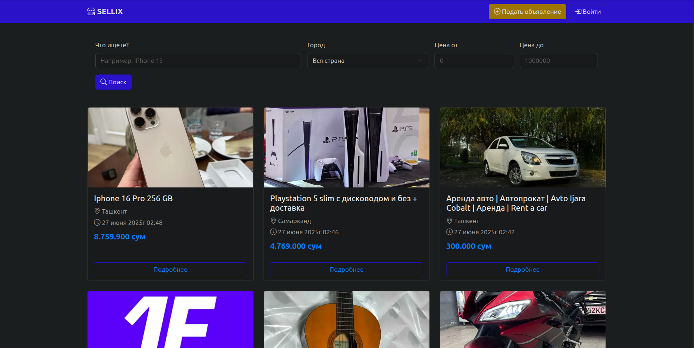
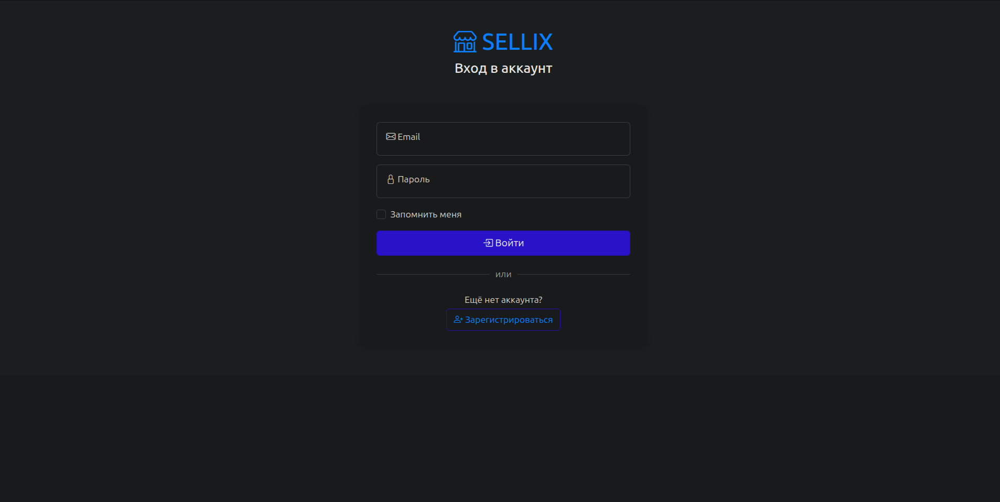
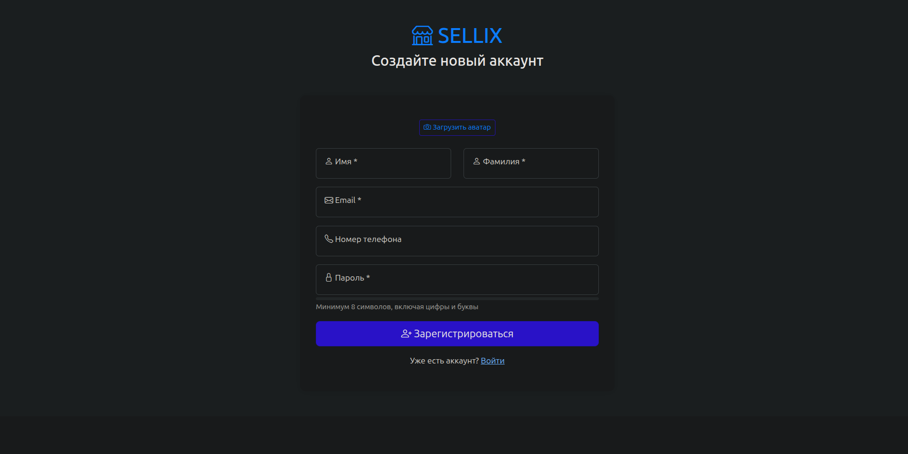
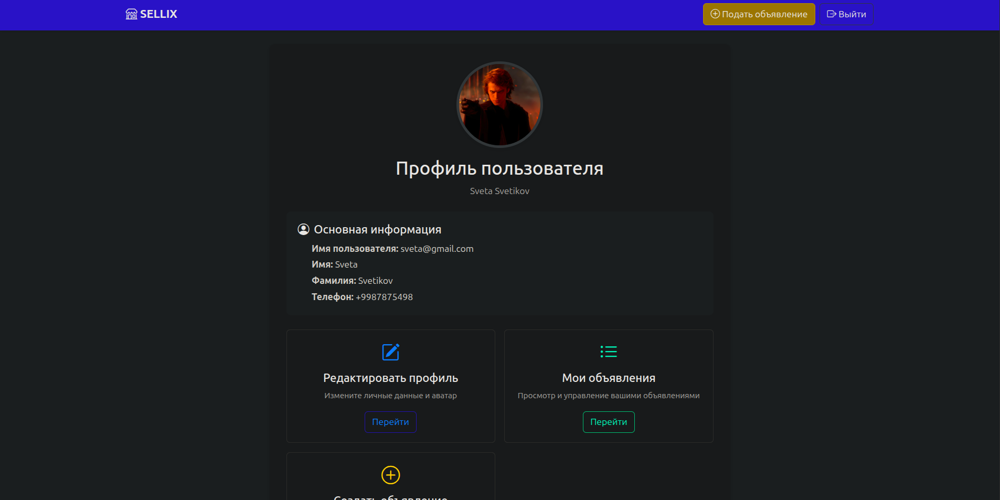
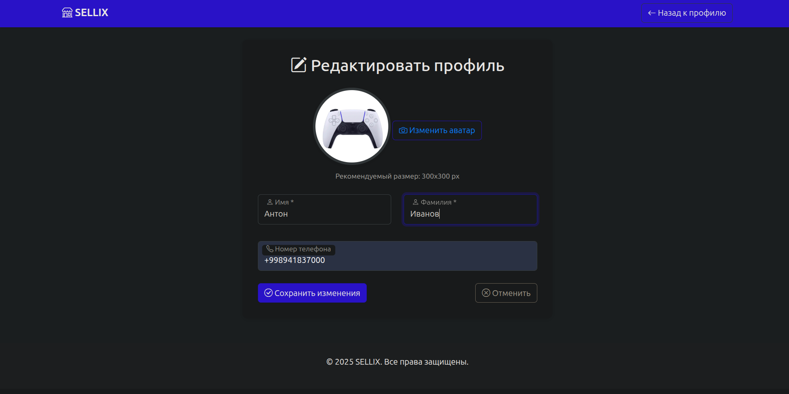
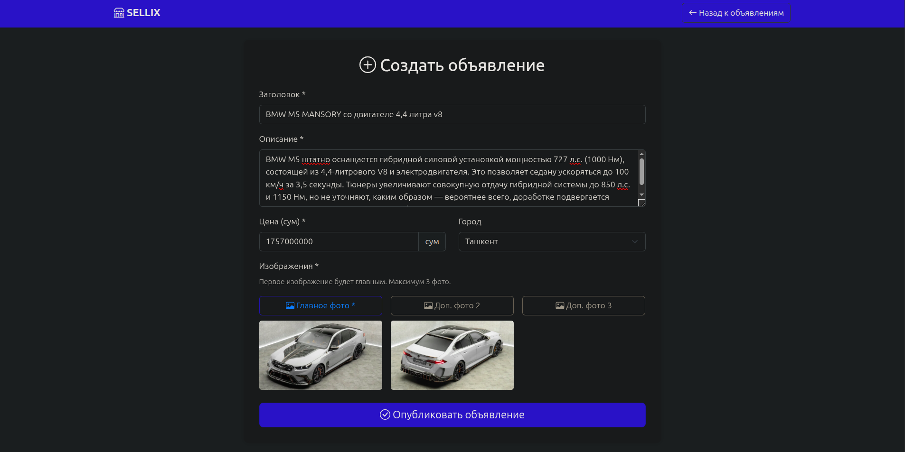
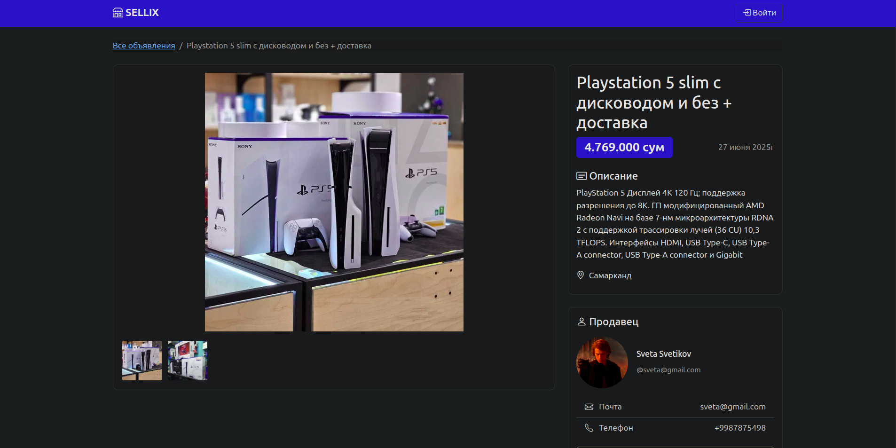
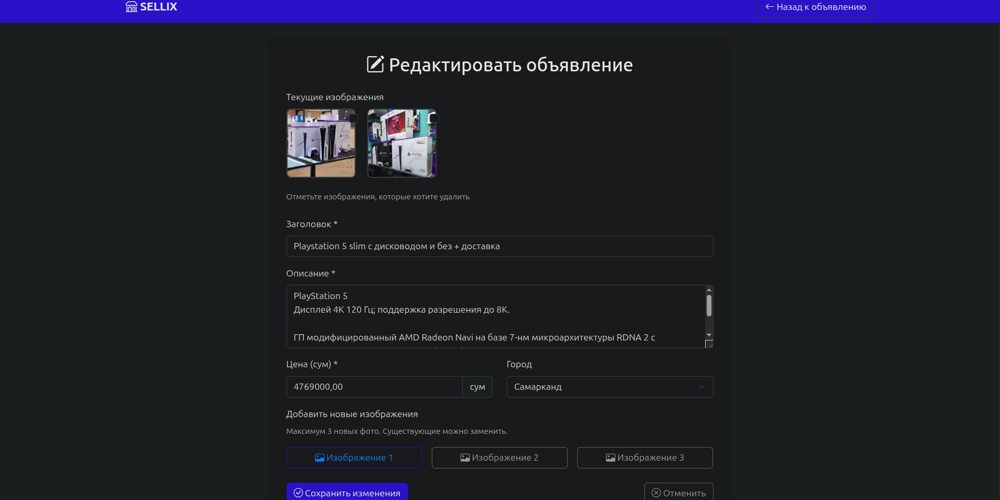

# SELLIX - Платформа объявлений

[](https://www.java.com/)
[](https://spring.io/projects/spring-boot)
[](https://getbootstrap.com/)

Аналог Avito/OLX для размещения объявлений о продаже товаров.

---

## 🛠 Технологии и зависимости

**Backend:**
- Java 21
- Spring Boot 3
- Spring Security
- Spring Data WEB
- Spring Data JPA
- Spring Validation
- Hibernate
- Lombok
- Thymeleaf
- PostgreSQL
- Liquibase

**Frontend:**
- Bootstrap 5.3.0
- Bootstrap Icons 1.10.0
- jQuery (через WebJars)

**Тестирование:**
- JUnit 5
- Spring Boot Test

---

## 📌 Основные страницы

### 🏠 Главная страница
- Поиск объявлений по названию, цене и городу
- Просмотр карточек товаров
- Пагинация результатов
- **Путь:** `/announcements`

<div align="center">
  
</div>

---

### 🔐 Аутентификация
#### Страница входа
- Вход в аккаунт (email/пароль)
- Ссылка на регистрацию
- **Путь:** `/login`

<div align="center">
  
</div>

#### Регистрация
- Создание нового аккаунта
- Загрузка аватара
- **Путь:** `/registration`

<div align="center">
  
</div>

---

### 👤 Профиль пользователя
#### Просмотр профиля
- Информация о пользователе
- Список объявлений
- **Путь:** `/users/{id}`

<div align="center">
  
</div>

#### Редактирование профиля
- Изменение личных данных
- Обновление аватара
- **Путь:** `/users/{id}/edit`

<div align="center">
  
</div>

---

### 🛍 Управление объявлениями
#### Создание объявления
- Форма добавления товара/услуги
- Загрузка до 3 фотографий
- **Путь:** `/announcements/create`

<div align="center">
  
</div>

#### Просмотр объявления
- Полная информация о товаре
- Контакты продавца
- **Путь:** `/announcements/{id}`

<div align="center">
  
</div>

#### Редактирование объявления
- Изменение данных товара
- Управление фотографиями
- **Путь:** `/announcements/{id}/edit`

<div align="center">
  
</div>

---

### 🛠️ Администрирование
- Управление пользователями
- Модерация объявлений
- **Путь:** `/admin`

<div align="center">
  
</div>

---

## 🚀 Запуск проекта

### 📦 Требования

- Установленный [Docker](https://www.docker.com/products/docker-desktop/)
- Установленный [Git](https://git-scm.com/)

### 🔧 Шаги

1. Клонируйте репозиторий:
   ```
   git clone https://github.com/Zoxid-Iskandarov/sellix.git
   cd sellix
2. Запустите контейнеры:
    ```
    docker compose up -d
    ```

    ✅ Приложение будет доступно по адресу: http://localhost:8080/announcements


3. Для остановки контейнеров:
    ```
    docker compose down
   ```

